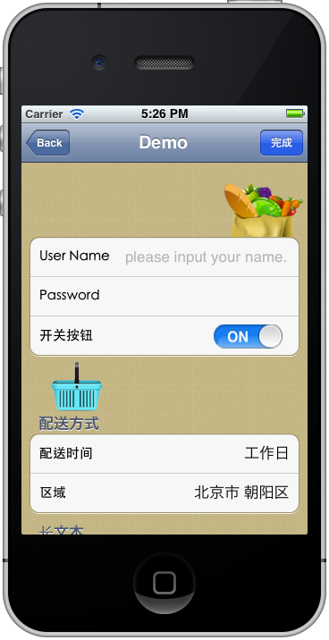
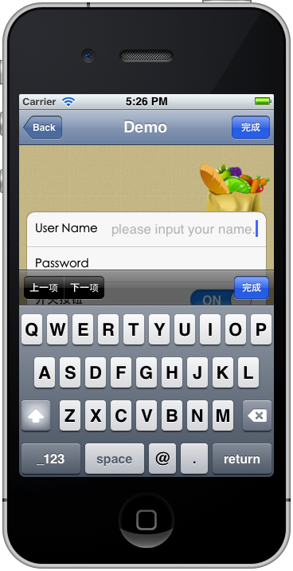
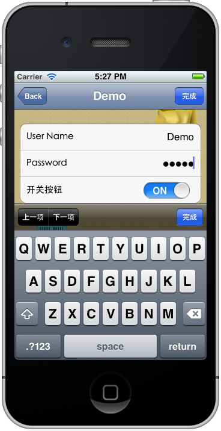
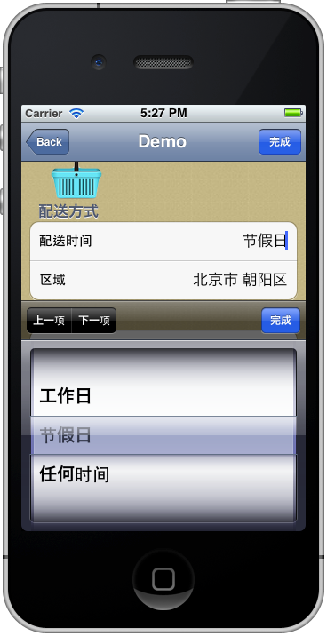
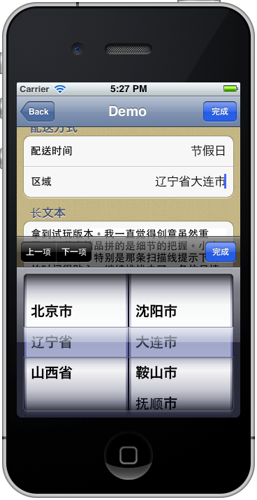
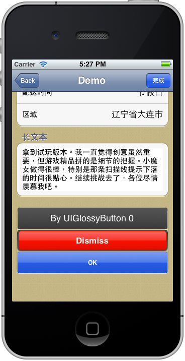

WfForm
----

Simple form view controller based on UITableView UITableViewCell

This project does not use ARC and target iOS5.1.   
I tested the codes only on iphone 5.1 simulator.   
I use UIGlossyButton to build button in UITableViewCell. Thanks waterlou.

----
##Snapshots

----
##Install

1.Download WfFormController.h and WfFormController.m.   
2.Download UIGlossyButton.h and UIGlossyButton.m from [here](https://github.com/waterlou/UIGlossyButton).   
3.Drag 4 files mentioned above into your project.   
4.Enjoy it.   

----
##How to use   

1.In your viewcontroller.m add "WfFormController.h".   
2.Add codes: 

    WfFormCell* textCell0 = [WfFormCell textFieldCell:@"User Name" value:@"" target:nil valueChanged:nil] ;   
    textCell0.keyboardType = UIKeyboardTypeEmailAddress ;   
    textCell0.placeHolder = @"please input your name." ;
    WfFormCell* textCell1 = [WfFormCell textFieldCell:@"Password" value:@"" target:nil valueChanged:nil] ;
    textCell1.useSecurity = YES ;
    
    WfFormCell* swi0 = [WfFormCell switcherCell:@"Switcher" value:YES target:self valueChanged:@selector(onSwitchValueChanged:)] ;
    
    NSArray* ds0 = [NSArray arrayWithObjects:[NSArray arrayWithObjects:@"exercising",@"studying",@"shopping",nil],nil] ;
    WfFormCell* picker0 = [WfFormCell pickerCell:@"Go" value:@"exercising" datasrc:ds0 target:self valueChanged:@selector(onPostTimeValueChanged:)] ;
    
    WfFormCell* boxCell = [WfFormCell textBoxCell:@"GitHub is the best place to share code with friends, co-workers, classmates, and complete strangers. Over three million people use GitHub to build amazing things together."] ;
    
    WfFormCell* button1 = [WfFormCell buttonCell:@"OK" target:self tapAction:@selector(onButtonTapped:) btnType:WfFormButtonCellTypeNavigationButton btnColor:nil];
    
    NSArray* cellArray0 = [NSArray arrayWithObjects:textCell0,textCell1,swi0,boxCell,button1, nil] ;
    
    WfFormSection* section0 = [WfFormSection sectionTitle:nil cells:cellArray0] ;
    section0.headerView = [[[UIImageView alloc] initWithImage:[UIImage imageNamed:@"headerViewImage.png"]] autorelease];
    section0.footerView = [[[UIImageView alloc] initWithImage:[UIImage imageNamed:@"footerViewImage.png"]] autorelease];

    NSArray* sectionArray = [NSArray arrayWithObjects:section0, nil] ;
    WfFormController* formControl = [[WfFormController alloc] initWithStyle:UITableViewStyleGrouped andSectionArray:sectionArray willComplete:^(void){
        NSLog(@"User Name: %@",textCell0.textValue) ;
        NSLog(@"Password: %@",textCell1.textValue) ;
        return YES ;
    }] ;
    formControl.title = @"Demo" ;
    [formControl autorelease] ;
    [self.navigationController pushViewController:formControl animated:YES] ;
    
    
----
##License   
  [The MIT License (MIT) ](http://opensource.org/licenses/mit-license.php)
